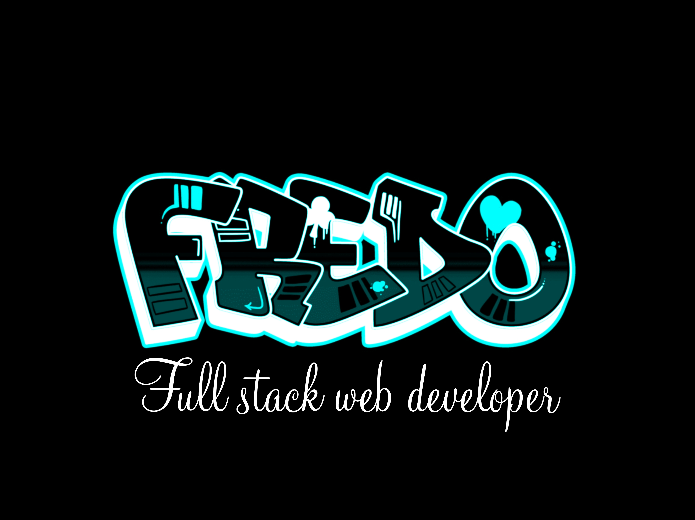

  
   

  <h3><b>Portfolio </b></h3>

# 📗 Table of Contents

- [📖 About the Project](#about-project)
  - [🛠 Built With](#built-with)
    - [Tech Stack](#tech-stack)
    - [Key Features](#key-features)
  - [🚀 Live Demo](#live-demo)
- [💻 Getting Started](#getting-started)
  - [Setup](#setup)
  - [Prerequisites](#prerequisites)
  - [Install](#install)
  - [Usage](#usage)
  - [Run tests](#run-tests)
  - [Deployment](#triangular_flag_on_post-deployment)
- [👥 Authors](#authors)
- [🔭 Future Features](#future-features)
- [🤝 Contributing](#contributing)
- [⭐️ Show your support](#support)
- [🙏 Acknowledgements](#acknowledgements)
- [❓ FAQ (OPTIONAL)](#faq)
- [📝 License](#license)

# 📖 [Portfolio-mobile-version] 

**[Portfolio-mobile-version]** is a the frist version of my portfolio 

## 🛠 Built With 

### Tech Stack 

  
Client

  <ul>
    <li>Html</li>
  </ul>
  <ul>
    <li>Css</li>
  </ul>
  <ul>
    <li>Javascript</li>
  </ul>

### Key Features 

- **[Display_Personel_information]**
- **[Responsive_mobile_min-width-375px]**
- **[Responsive_desktop_min-width-768px]**
- **[Responsive_desktop_width->768px]**
- **[Display-project-section]**
- **[Display-aboutme-section]**
- **[Display-contactMe-section]**
- **[Online-deployment]**
- **[Display-menu-link]**
- **[Popup-window-viewer]**
- **[Add-validation-for-email]**

(<a href="#readme-top">back to top</a>)

## 🚀 Live Demo 

- [Live Demo Link](https://fredostfleur-portfolio.netlify.app/)

(<a href="#readme-top">back to top</a>)

## 💻 Getting Started 

To get a local copy up and running, follow these steps.

### Prerequisites

In order to run this project you need:

-A code editor installed that can run HTML and CSS files 
-linters installed on your repo or code editor

### Setup

Clone this repository to your desired folder:

Use the command: 
 cd your-folder
gh repo clone fredo509/Portfolio_setup_mobile_first

### Install

Install this project with:

Install WebHint: npm install --save-dev hint@7.x

Install StyleLint npm install --save-dev stylelint@13.x stylelint-scss@3.x stylelint-config-standard@21.x stylelint-csstree-validator@1.x

### Usage

To run the project, execute the following command:

Open the copied folder and run the index.html file

### Run tests

To run tests, run the following command:

With linters correctly installed, npx stylelint "**/*.{css,scss}"

To fix CSS or SCSS linters error: npx stylelint "**/*.{css,scss}" --fix

### Deployment

You can deploy this project using:

-Vs code or any code Editor
-A browser

(<a href="#readme-top">back to top</a>)

## 👥 Authors 

👤 **Author-1**

- GitHub: [@fredo509](https://github.com/fredo509)
- Twitter: [@fredo_st_fleur](https://twitter.com/Fredo_st_fleur?t=OEPwMJjspBTEnTevArv0HA&s=09)
- LinkedIn: [Fredo st fleur](https://www.linkedin.com/in/fredo-st-fleur)

**Author-2**

- GitHub: [@danifromecuador](https://github.com/danifromecuador)
- Twitter: [@danifromecuador](https://twitter.com/danifromecuador)
- LinkedIn: [Dani Morillo](https://www.linkedin.com/in/danifromecuador)

👤 **Author3**

- GitHub: [@Booze33](https://github.com/Booze33)
- Twitter: [@twitterhandle](https://twitter.com/twitterhandle)
- LinkedIn: [LinkedIn](https://linkedin.com/in/linkedinhandle)

## 🔭 Future Features 

- [ ] **[Add-lighter-on-navBar]**

(<a href="#readme-top">back to top</a>)

## 🤝 Contributing 

Contributions, issues, and feature requests are welcome!

Feel free to check the [issues page](../../issues/).

(<a href="#readme-top">back to top</a>)

## ⭐️ Show your support 

If you like this project please givee me a star

(<a href="#readme-top">back to top</a>)

## 🙏 Acknowledgments 

I would like to thank microverse for this beautiful project.

(<a href="#readme-top">back to top</a>)

(<a href="#readme-top">back to top</a>)

## 📝 License 

This project is [MIT](./LICENSE) licensed.

(<a href="#readme-top">back to top</a>)

